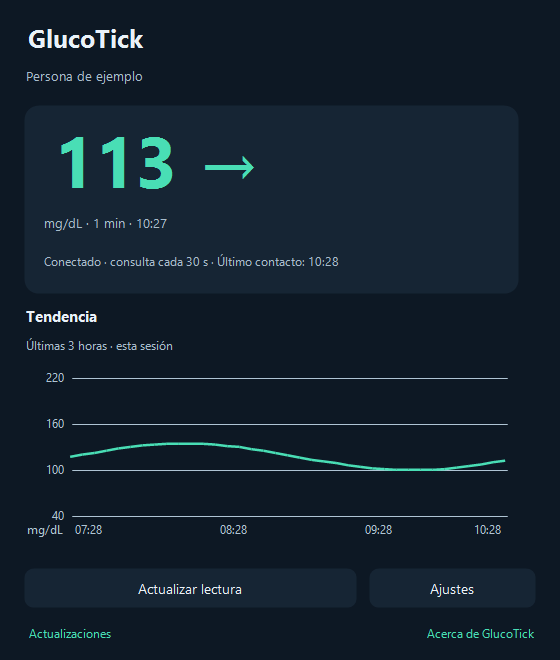

# GlucoTick

**Tu glucosa, a un vistazo en Windows.**

GlucoTick muestra las lecturas de tu cuenta de LibreLinkUp junto al reloj de tu PC. Elige cómo verlas, personaliza tus colores y recibe avisos si quieres.

**[Descubre GlucoTick y sus capturas](https://tiri14.github.io/glucotick-releases/)** · **[Descargar la última versión para Windows](https://github.com/tiri14/glucotick-releases/releases/latest)**

## Elige dónde ver la glucosa

- **Bandeja de Windows:** muestra el valor o el icono de GlucoTick. El menú del botón derecho da acceso a vistas, ajustes y actualizaciones.
- **Número grande:** lectura con fondo transparente en la barra de tareas; ajusta ancho, posición y monitor.
- **Reloj de Windows 11:** integración opcional con Windhawk, guiada por un asistente. Las otras vistas funcionan sin Windhawk y puedes combinarlas.
- **Panel de glucosa:** valor, tendencia, hora, antigüedad, conexión y gráfica de las últimas tres horas recibidas en la sesión actual.

## Instala y conecta

1. Abre la [última publicación](https://github.com/tiri14/glucotick-releases/releases/latest) y descarga **GlucoTick-Setup-VERSIÓN.exe**. Ejecútalo y sigue el asistente. No necesitas extraer el ZIP; los archivos automáticos «Source code» no son instaladores.
2. Comprueba que ves las lecturas en LibreLinkUp y que has aceptado la invitación de seguimiento.
3. En GlucoTick, abre **Ajustes → Cuenta**, pulsa **Conectar y comprobar cuenta**, selecciona la persona y guarda los ajustes.
4. Elige tus vistas en **Visualización**. Puedes configurar el reloj más adelante.

**Requisitos:** Windows 10 versión 2004 o posterior, o Windows 11; PC x64; .NET Framework 4.8; Internet; cuenta de LibreLinkUp con acceso a las lecturas. La integración con Windhawk requiere Windows 11 x64: primera preparación de hasta 313 MiB, 4 GB libres y posible permiso de administrador.

Los instaladores actuales no tienen firma de editor de confianza de Windows. Descarga desde las publicaciones de este repositorio. Los archivos `.sha256` permiten comprobar la integridad del paquete; no sustituyen una firma del editor.

## Personaliza la aplicación

- Tema claro, oscuro o de Windows; unidades mg/dL o mmol/L; inicio con Windows.
- Cuatro límites de color comunes al panel, bandeja, número grande y reloj.
- Avisos opcionales de glucosa baja/alta y falta de lecturas recientes, con límites independientes de los colores.
- Oculta el nombre o activa el **modo privado** para ocultar temporalmente las lecturas y la gráfica en todas las vistas y suspender los avisos de glucosa.
- Reparación y desactivación de la integración del reloj desde su asistente. Las versiones de Windhawk no validadas se conservan, sin rebajarlas automáticamente.

## Datos recientes y actualizaciones

Los minutos cuentan desde la hora de la medición y siguen aumentando aunque no lleguen datos nuevos. Después de **más de cinco minutos**, todos los indicadores de glucosa se vuelven **grises**, conservando el último valor y su antigüedad. Revisa el móvil y LibreLinkUp si ocurre.

Una nueva versión se muestra en el panel, el menú de bandeja y, si Windows lo permite, mediante una notificación. En **Ver novedades y descargar** decides cuándo instalar. Puedes ver tamaño, progreso y velocidad; la actualización verifica el paquete y conserva tu cuenta y tus preferencias. Guarda antes los ajustes pendientes.

Cerrar la ventana deja GlucoTick en la bandeja. Para cerrar la aplicación, elige **Salir** en el menú del icono. Desinstalar desde Windows permite conservar o borrar tus datos locales.

## Privacidad, ayuda y versiones

El acceso se guarda cifrado para tu usuario de Windows. Las lecturas y la gráfica permanecen en memoria durante la sesión. La aplicación conecta con LibreLinkUp para consultar y con GitHub para actualizar; no incluye telemetría propia ni envía diagnósticos automáticamente.

- [Guía, capturas y preguntas frecuentes](https://tiri14.github.io/glucotick-releases/)
- [Información de privacidad](https://tiri14.github.io/glucotick-releases/privacidad.html)
- [Todas las versiones y sus novedades](https://github.com/tiri14/glucotick-releases/releases)
- [Comunicar un problema](https://github.com/tiri14/glucotick-releases/issues): indica versión y Windows; evita datos personales, lecturas, credenciales y registros sin revisar.

GlucoTick es un **visor complementario independiente de Abbott**. Conserva la aplicación y las alarmas oficiales de Libre. Libre y LibreLinkUp son marcas de sus respectivos titulares.

Este repositorio contiene descargas públicas, documentación y la web. El código C# principal permanece privado. Las capturas muestran datos ficticios.
